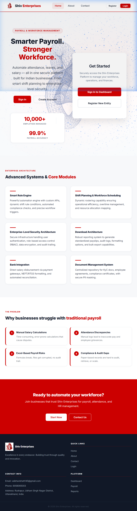
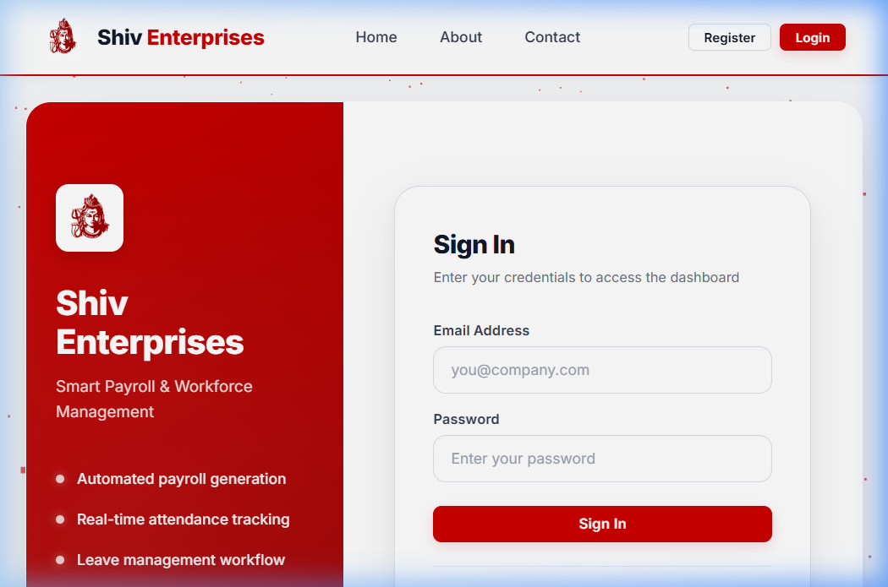
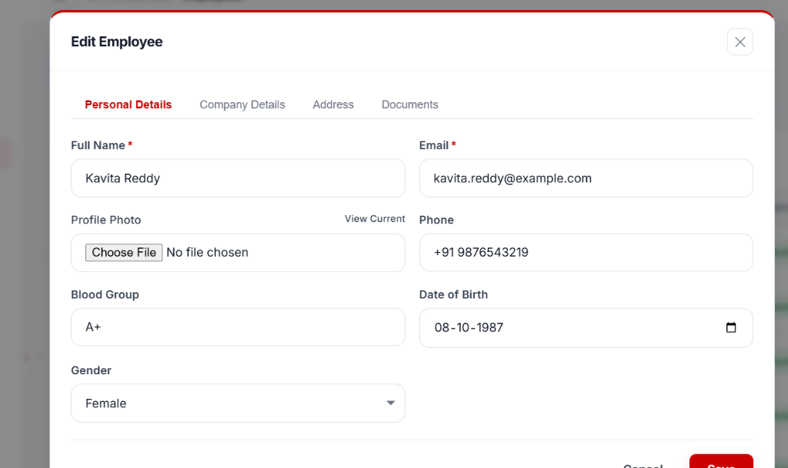

# 🏭 Shiv Enterprises — Smart Payroll & Workforce Management System

A full-stack, role-based payroll and workforce management platform built for **Shiv Enterprises**, a premier manpower supplier and contractor specialising in skilled workforce supply, compliance management, and on-site supervision across industrial and construction sectors.

---

## 🌐 Live Demo

| | Link |
|---|---|
| 🖥️ **Frontend (Vercel)** | [shiv-enterprises-three.vercel.app](https://shiv-enterprises-three.vercel.app) |
| ⚙️ **Backend API (Render)** | [smart-payroll-management-system-2.onrender.com](https://smart-payroll-management-system-2.onrender.com) |

> **Test Login:**  Email: `vaibhavbhatt145@gmail.com` | Password: `Vai@1234`

---

## 📸 Screenshots

### Home Page


### Login Page


### Feature Architecture


---

## ✨ Live Features

| Module | Description |
|---|---|
| **Public Website** | Home, About, Contact pages with company information and contact form |
| **Role-Based Dashboards** | Separate dashboards for Admin, Manager, Supervisor, and Employee roles |
| **Employee Management** | Full CRUD with profile photos, Aadhaar, PAN, bank details, and document uploads |
| **Department Management** | Create and manage company departments |
| **Attendance System** | Daily attendance marking, bulk entry, and shift management |
| **Leave Management** | Employee leave applications with approval workflow |
| **Payroll & Salary** | Salary generation, salary structure setup, and payslip downloads |
| **Audit Logs** | Track all admin actions across the platform |
| **Email Notifications** | Automatic email alerts on contact form submissions (via Nodemailer) |

---

## 🛠️ Tech Stack

### Frontend
| Technology | Purpose |
|---|---|
| **React 18** | UI framework with lazy-loaded pages |
| **React Router DOM v7** | Client-side routing |
| **Recharts** | Dashboard charts (bar, pie) |
| **jsPDF + AutoTable** | PDF salary slip generation |
| **XLSX** | Excel export for payroll data |
| **Three.js** | 3D animated hero section |
| **React Hot Toast** | Toast notifications |
| **Vite** | Build tool and dev server |

### Backend
| Technology | Purpose |
|---|---|
| **Node.js + Express** | REST API server |
| **MongoDB Atlas + Mongoose** | Cloud database and ODM |
| **JWT (jsonwebtoken)** | Stateless authentication via HTTP-only cookies |
| **bcrypt** | Password hashing |
| **Multer + Cloudinary** | File upload handling with cloud storage |
| **Nodemailer** | Email notifications for contact form |
| **dotenv** | Environment variable management |

---

## 📁 Project Structure

```
Shiv_Enterprises/
├── Backend/
│   ├── config/                # Database connection & seeders
│   ├── controllers/           # Business logic and request handlers (MVC Controller)
│   ├── middleware/            # JWT validation, RBAC, and error handlers
│   ├── models/                # Mongoose Database Schemas (MVC Model)
│   ├── routes/                # Express API endpoint definitions
│   ├── utils/                 # Response formatters and validators
│   └── index.js               # Unified Monolithic server entry point
│
├── Frontend/
│   ├── src/
│   │   ├── controllers/       # Business Logic & State (MVC Controller layer)
│   │   │   ├── context/       # Auth and global state
│   │   │   └── hooks/         # Custom React hooks
│   │   ├── models/            # Data Layer (MVC Model layer)
│   │   │   └── api.js         # Axios instances and API services
│   │   ├── views/             # Presentation Layer (MVC Views layer)
│   │   │   ├── components/    # Reusable React UI blocks
│   │   │   ├── layouts/       # Dashboard & Public structural templates
│   │   │   └── pages/         # Feature-based view screens (Attendance, Payroll, etc.)
│   │   ├── assets/            # Static files
│   │   ├── styles/            # Vanilla CSS stylesheets
│   │   ├── utils/             # Formatters, Exporters
│   │   ├── App.jsx            # Router and Component mappings
│   │   └── main.jsx           # React DOM renderer
│   └── vercel.json            # Vercel deployment SPA routing config
│
└── docs/screenshots/          # README screenshots
```

---

## 👥 Role-Based Access

| Role | Access Level |
|---|---|
| **Admin** | Full access — all modules, all employee data, audit logs, payroll |
| **Manager** | Employees, departments, attendance, payroll history |
| **Supervisor** | Attendance marking for their team, leave approval |
| **Employee** | Own dashboard — personal attendance, leave applications, salary slips |

---

## ⚙️ Local Setup & Installation

### Prerequisites
- Node.js v18+
- MongoDB (local) or MongoDB Atlas URI

### 1. Clone the Repository

```powershell
git clone https://github.com/vaibhav1826/Smart_Payroll_Management_System.git
cd Smart_Payroll_Management_System
```

### 2. Backend Setup

```powershell
cd Backend
npm install
```

Create a `.env` file in `Backend/`:

```env
PORT=4000
MONGO_URI=mongodb://localhost:27017/shiv_enterprises
JWT_SECRET=your_jwt_secret
JWT_EXPIRES_IN=7d
FRONTEND_URL=http://localhost:3000
SMTP_HOST=smtp.gmail.com
SMTP_PORT=587
SMTP_USER=your@gmail.com
SMTP_PASS=your_app_password
CLOUDINARY_CLOUD_NAME=your_cloud_name
CLOUDINARY_API_KEY=your_api_key
CLOUDINARY_API_SECRET=your_api_secret
```

```powershell
npm run dev    # Starts on http://localhost:4000
```

### 3. Frontend Setup

```powershell
cd ../Frontend
npm install
npm run dev    # Starts on http://localhost:3000
```

### 4. Run Both Together (from root)

```powershell
npm install
npm run dev
```

---

## 🔑 Default Admin Login

| Field | Value |
|---|---|
| **Email** | `vaibhavbhatt145@gmail.com` |
| **Password** | `Vai@1234` |
| **Secret Key** | `SHIV_REQ_2026` *(for registration)* |

---

## 🌐 API Routes Overview

### Auth
| Method | Route | Description |
|---|---|---|
| `POST` | `/api/auth/login` | Login and set JWT cookie |
| `POST` | `/api/auth/register` | Register (requires secret key) |
| `POST` | `/api/auth/logout` | Clear session |
| `GET` | `/api/auth/me` | Get current logged-in user |

### Employees
| Method | Route | Description |
|---|---|---|
| `GET` | `/api/employees` | List all employees |
| `POST` | `/api/employees` | Create employee (with photo upload) |
| `PUT` | `/api/employees/:id` | Update employee |
| `DELETE` | `/api/employees/:id` | Delete employee |

### Attendance
| Method | Route | Description |
|---|---|---|
| `GET` | `/api/attendance` | List records (filterable by month/year) |
| `POST` | `/api/attendance` | Mark single attendance |
| `POST` | `/api/attendance/bulk` | Bulk mark attendance |

### Other
| Method | Route | Description |
|---|---|---|
| `POST` | `/api/contact` | Contact form — sends email notification |
| `GET` | `/api/departments` | List departments |
| `GET` | `/api/payroll` | Payroll records |
| `GET` | `/api/shifts` | List shifts |
| `GET` | `/api/audit-logs` | Admin-only audit trail |

---

## 🚀 Deployment

| Service | Platform | URL |
|---|---|---|
| Frontend | Vercel | [shiv-enterprises-three.vercel.app](https://shiv-enterprises-three.vercel.app) |
| Backend | Render | [smart-payroll-management-system-2.onrender.com](https://smart-payroll-management-system-2.onrender.com) |
| Database | MongoDB Atlas | Cloud-hosted |
| Media Storage | Cloudinary | Cloud-hosted |

---

## 🗑️ Reset Database

```powershell
cd Backend
node resetDatabase.js
```

Restart the backend after — the default admin is re-seeded automatically.

---

## 📄 License

Proprietary software developed for **Shiv Enterprises**.  
All rights reserved © 2026 Shiv Enterprises.
